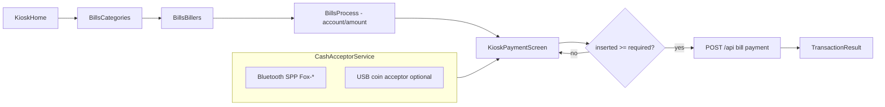

# DaFox Kiosk Bills Payment — Hardware & APK Scan

**Session:** 2026-05-28 (read-only)  
**Workspace:** `c:\laragon\www\ePay Plus`  
**APK reference:** `c:\Users\Admin\Downloads\DaFoxTechTablet.apk`  
**ADB:** `C:\Users\Admin\Android\Sdk\platform-tools\adb.exe`

---

## 1. Devices connected this session

| Channel | Status | Details |
|---------|--------|---------|
| **ADB / Android tablet** | **Connected** | `JH2404230714` — `Smart_9` (product `full_k37mv1_bsp`), transport `usb` |
| **COM3 / CP210x (ESP Fox-B068B8)** | **Not connected** | `[System.IO.Ports.SerialPort]::GetPortNames()` returned **empty**; `cp210x_serial_probe.py COM3` → `FileNotFoundError` (no COM port) |

**Prior session note (from `docs/HARDWARE_CP2102_WINDOWS.md`):** When plugged in, COM3 showed **ESP32-D0WD-V3**, MAC `b0:cb:d8:8a:68:b8`, firmware banner **DafoxTech ESP Bluetooth module (TOP BA) v40.1.2**, BT name `Fox-B068B8`, app UART **9600 8N1**.

**Screenshot captured:** `docs/dafox_screenshot.png` — DaFox **KioskHome** v4.1.2.2, TESTING MODE, four tiles including **BILLS PAYMENT**.

---

## 2. DaFox app version + Bluetooth paired devices

### Package

| Field | Value |
|-------|--------|
| Package | `com.dafox.eloading` |
| versionName | **41.2.2** (UI shows v4.1.2.2) |
| versionCode | 4122 |
| targetSdk | 34 |
| dataDir | `/data/user/0/com.dafox.eloading` |
| firstInstall | 2026-05-27 10:18:21 |

### Bluetooth bonded (tablet)

```
B0:CB:D8:8A:68:BA [BR/EDR] Fox-B068B8    ← DaFox ESP bill/coin bridge (matches CP210x MAC)
86:67:7A:A4:CB:E8 [DUAL]  PT-210_CBE8    ← likely Bluetooth printer
```

DaFox toggles Bluetooth enable/disable on a ~90s cadence (`Disabled` / `Enabled` by `com.dafox.eloading` in `dumpsys bluetooth_manager`).

### Foreground activity

- **KioskHome** (`com._d.eloading.activities.KioskHome`) — launcher-style kiosk menu.
- **TermsDialog** was on top when attempting navigation; bill sub-activities are **not exported** (cannot `am start` from shell uid 2000).

### Data extraction

| Method | Result |
|--------|--------|
| `run-as com.dafox.eloading` | **Denied** — package not debuggable |
| `adb backup` | Not run (would need on-device confirmation; avoided) |

**Room DB tables (from DEX/SQL strings):** `Machine` (`mac_address`), `Activation` (`machineAddress`, `icc_id`), `AppSettings` (`enableBillsPayment`, `enablePisowifi`, …), `BillsFee`, `Customer` (`totalCredit`, `bills_payment_credits`), `BillPaymentsData` / `BillCategoryData` / `BillerData`, `Txn`, `LoadDenom`.

---

## 3. Logcat / protocol clues

### Logcat (60s after `logcat -c`, KioskHome foreground)

- **No** `DafoxService` tagged lines at default filters.
- Dominant lines: `BufferQueueProducer` for `KioskHome` SurfaceView (~30 fps video background).
- Filtered dump: `"Bluetooth device is not connected."` exists in APK strings; not emitted during idle home screen.

### APK protocol indicators (static)

| Clue | Finding |
|------|---------|
| BT transport | `createRfcommSocketToServiceRecord`, SPP UUID `00001101-0000-1000-8000-00805f9b34fb` |
| Serial (on-device / USB) | `tp.xmaihh.serialport.SerialHelper`, `ComBean`, stick helpers `AbsStickPackageHelper`, `SpecifiedStickPackageHelper`, `StaticLenStickPackageHelper` |
| USB serial drivers | `com.hoho.android.usbserial` (Cp21xx, Ftdi, Ch34x, CdcAcm, Prolific) |
| User-facing cash UI | **`Amount Inserted:`** (matches ePay Plus `KioskPaymentScreen` copy) |
| Cash animations | `insert_coin`, `insert_bills_animation` |
| Machine pairing | `Machine.mac_address`, `machine.mac_address`, `machineAddress` in `Activation` |
| Bills feature flag | `AppSettings.enableBillsPayment` |
| Error string | `Unable to connect to bluetooth device.` |

**No** explicit `inhibit`, `escrow`, `MDB`, or `billAcceptor` class names in DEX strings — cash hardware is likely abstracted behind **DafoxService + BT/serial framing**, not exposed as named MDB commands in the APK.

### COM3 serial (this session)

Not available — **no hex capture**. Re-run when CP210x is plugged:

```powershell
python scripts/cp210x_serial_probe.py COM3
# Optional 30s passive capture while inserting bill on paired tablet:
python scripts/cp210x_passive_capture.py COM3 30
```

---

## 4. Kiosk bill payment flow map (activities / intents)

### Core kiosk bills chain (non-exported — in-app navigation only)

```
KioskHome
  └─► KioskBillsPayment          (category / biller list)
        ├─► KioskBillsPaymentFav
        ├─► KioskBillAccountPrompt   (account number)
        ├─► KioskBillPaymentPrompt   (amount + cash insert UI)
        ├─► KioskBillProcessing      (API / backend)
        └─► KioskBillResult
```

### Parallel “modern theme” (agent / non-kiosk)

`BillCategoriesActivity` → `BillersListActivity` → `BillAccountPromptActivity` → `BillPaymentPromptActivity` → `BillProcessingActivity` → `BillResultActivity`

### Services & receivers (hardware / kiosk lockdown)

| Component | Role |
|-----------|------|
| `com._d.eloading.services.DafoxService` | Foreground service, `foregroundServiceType=connectedDevice` — **BT/serial cash bridge** |
| `BackgroundService` | Background tasks |
| `ServiceTrigger` / `restartservice` | Service watchdog |
| `FoxDeviceAdminReceiver` | Device admin / kiosk lock |
| `PowerButtonAccessibilityService` | Blocks power menu |
| `SmsReceiver` | SMS activation / OTP |

### Intent launch via ADB

```bash
# Works (exported launcher path):
adb shell am start -n com.dafox.eloading/com._d.eloading.activities.KioskHome

# Blocked (not exported):
adb shell am start -n com.dafox.eloading/com._d.eloading.activities.KioskBillsPayment
# → SecurityException: not exported from uid 10089
```

Manual UI: tap **BILLS PAYMENT** on KioskHome (portrait **800×1280**; dismiss **TermsDialog** first). Automated `uiautomator dump` failed (`null root node`) on this device build.

---

## 5. Build spec — ePay Plus Bills Payment Kiosk

### Current ePay Plus state

| Area | Status |
|------|--------|
| Kiosk nav | `KioskNavigation` → BillsCategories → BillsBillers → **BillsProcessScreen** |
| Cash UI | **`KioskPaymentScreen` exists** but **not registered** in `NavRoutes` / `KioskNavigation` |
| Cash hardware | `UsbCoinAcceptorService` (USB bulk, denomination map `0x01`–`0x09`) — **not wired** to bills flow |
| BT | `BluetoothPrinter` / `BluetoothPrinterService` — **printer only**, not Fox bridge |
| Bill POST | `BillsViewModel.processBillPayment` → `TransactionRepository.processBillPayment` with **`paymentMethod = "WALLET"`** — no cash gate |

### Target architecture (mirror DaFox)



### Components to implement

1. **`CashAcceptorService` (singleton, foreground)**  
   - Bond/connect to `Fox-{MAC suffix}` via SPP UUID `00001101-0000-1000-8000-00805f9b34fb`.  
   - Parse incoming frames (capture protocol from logcat + COM3 sniff); emit `StateFlow<Double>` `amountInserted` and events `BillAccepted`, `CoinAccepted`, `Disconnected`.  
   - Persist paired MAC in DataStore (`fox_mac_address`) — mirror DaFox `Machine.mac_address`.  
   - Optional: delegate to `UsbCoinAcceptorService` when USB acceptor present (ePay denomination table is a starting guess only).

2. **`FoxPairingWizard` (Compose screen in Settings / first-run kiosk)**  
   - Scan bonded devices, filter `Fox-*`, test connect, save MAC.  
   - Show link to `docs/HARDWARE_CP2102_WINDOWS.md` for ESP UART debugging.

3. **Navigation changes**  
   - Add `NavRoutes.KioskPayment` with `{requiredAmount}` (and optional `billerCode`, `accountNumber`).  
   - After confirm on `BillsProcessScreen`, **navigate to `KioskPaymentScreen`** instead of immediate `processBillPayment`.  
   - On `onConfirm` when `insertedAmount >= requiredAmount`, call `BillsViewModel.processBillPayment` then result screen.

4. **`BillsViewModel` / repository**  
   - Set `paymentMethod = "CASH"` (or `CASH_BILLS`) and store `cashInserted`, `changeDue` on `TransactionEntity`.  
   - On API failure after cash taken: surface reversal / support state (DaFox uses credits ledger — see `bills_payment_credits`).

5. **`KioskService` integration**  
   - Start `CashAcceptorService` when entering kiosk mode; stop/inhibit acceptor when leaving payment screen (protocol TBD after capture).

6. **Hardware setup checklist**  
   - Tablet paired to **Fox-B068B8** (already done on scan device).  
   - ESP powered; **TP70** (or equivalent pulse bill acceptor with **high-level anti-fake detection**) connected to ESP on **TOP BA** firmware path — pulse interface, not direct tablet UART.  
   - Bluetooth **PT-210** thermal printer paired separately for receipts.  
   - `enableBillsPayment` equivalent: feature flag in ePay kiosk settings.

### APIs (unchanged backend contract)

Existing: `EPayApiService.processBillPayment(BillPaymentRequest)` — call **only after** cash threshold met.

```kotlin
// Today (gap):
paymentMethod = "WALLET"

// Target:
paymentMethod = "CASH"
// + fields: cashTendered, deviceMac, foxFirmwareVersion (optional)
```

---

## 6. Next actions

| Priority | Action |
|----------|--------|
| P0 | **Protocol capture:** With tablet on `KioskBillPaymentPrompt`, run `adb logcat -s DafoxService:* BluetoothSocket:* *:E` while inserting bill/coin; save log. |
| P0 | **Re-plug CP210x** and run `python scripts/cp210x_serial_probe.py COM3` during insert (parallel BT path). |
| P1 | Implement `CashAcceptorService` + wire `KioskPaymentScreen` into `KioskNavigation`. |
| P1 | Add `FoxPairingWizard` + DataStore MAC. |
| P2 | Map byte protocol (from capture) to denomination table; replace placeholder `UsbCoinAcceptorService` map. |
| P2 | Bills fee lookup (`BillsFee` min/max/fee) — align with DaFox `BillsFee` model if portal fees differ. |
| P3 | `adb backup -f dafox.ab com.dafox.eloading` on device (user confirms) to inspect prefs without debuggable build. |

### Artifacts from this scan

- `docs/dafox_screenshot.png` — KioskHome  
- `docs/dafox_apk_extract/unzipped/` — extracted APK (local only, do not commit)  
- `C:\Users\Admin\AppData\Local\Temp\dafox_logcat.txt` — 60s logcat buffer  

---

## Appendix: ePay Plus ↔ DaFox activity mapping

| DaFox | ePay Plus (target) |
|-------|-------------------|
| `KioskBillsPayment` | `BillsCategoriesScreen` + `BillsBillersScreen` |
| `KioskBillAccountPrompt` | Account field on `BillsProcessScreen` |
| `KioskBillPaymentPrompt` | **`KioskPaymentScreen`** (new route) |
| `KioskBillProcessing` | `BillsViewModel` + loading state |
| `KioskBillResult` | `TransactionResultScreen` |
| `DafoxService` | **`CashAcceptorService`** (new) |
