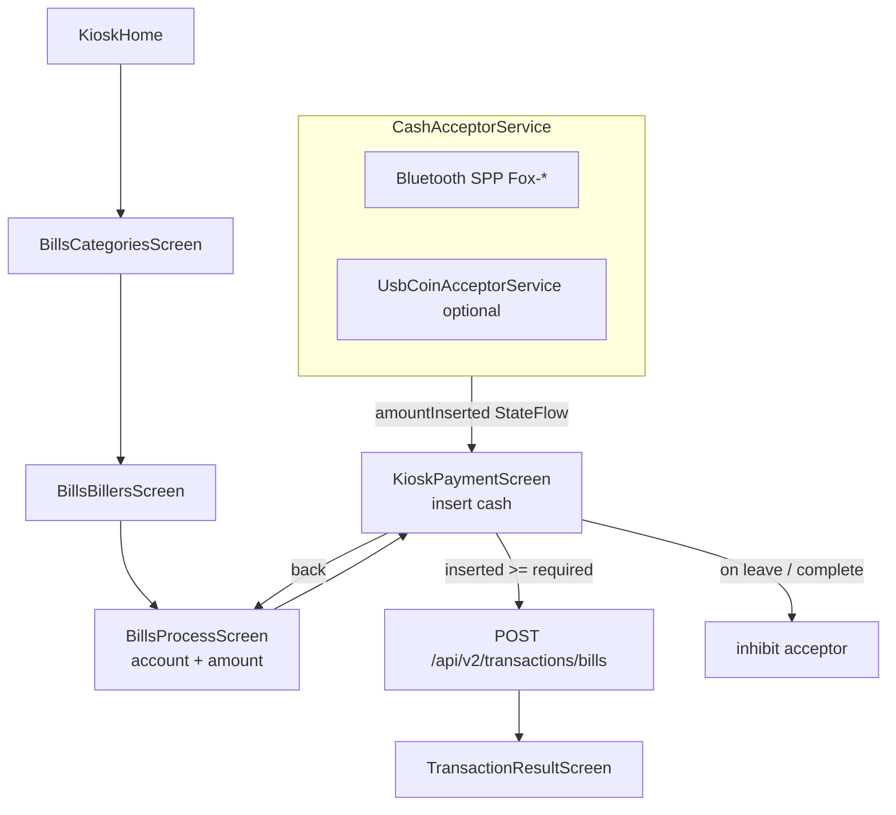

# ePay Plus — Bills Payment Kiosk Starter Guide

**Version:** 2026-05-28  
**Audience:** First-time builders in the Philippines (sari-sari store owners, technicians, developers)  
**Workspace:** `c:\laragon\www\ePay Plus`

This guide helps you build an **ePay Plus Bills Payment Kiosk** from scratch. It assumes you may have a **DaFox** reference unit nearby, but you will **study** how it works — not copy its code or firmware.

---

## 1. Purpose — clean-room study vs cloning

### What this project is

An **ePay Plus kiosk** lets customers pay utility and government bills (Meralco, PLDT, etc.) by inserting **cash** (coins and/or bills) at a locked-down Android tablet. The tablet talks to your Laravel backend, which posts the payment through the **Maya Partner Biller API**.

### What “study DaFox, don’t clone” means

| ✅ Ethical / legal (do this) | ❌ Not acceptable (don’t do this) |
|-----------------------------|-----------------------------------|
| Observe **user flow** on a DaFox kiosk (tap sequence, screens, cash timing) | Decompile and paste DaFox Java/Kotlin into ePay Plus |
| Capture **your own** Bluetooth/serial logs while **you** insert test cash | Copy DaFox APK assets, branding, or proprietary firmware |
| Document **protocol patterns** (SPP UUID, pulse counts, inhibit timing) from logs you generate | Redistribute DaFox firmware or bypass their activation |
| Build **original** `CashAcceptorService` in ePay Plus that speaks the same *hardware* language | Ship an app that impersonates `com.dafox.eloading` |

**Why it matters:** DaFox and ePay Plus are separate products. Hardware bridges (Fox ESP modules) are often shared in the Philippine market, but **software must be yours**. Clean-room means: learn *behaviour* from observation, then implement fresh code with your own naming, tests, and backend.

### Success criteria for a first kiosk

1. Customer selects biller → enters account → sees amount due → inserts cash → payment posts → receipt prints.  
2. Cash is **blocked from posting** until `inserted >= required`.  
3. Backend records `payment_method = CASH` and supports **kiosk collection** (cash pickup reconciliation).  
4. Staff can exit kiosk mode safely (PIN / device admin).

---

## 2. Glossary

Terms you will hear in the field and in this repo. Every jargon word is defined here first.

| Term | Plain meaning |
|------|----------------|
| **Pulse** | A short electrical signal from a coin or bill acceptor — usually one pulse = one denomination (e.g. one pulse = ₱20). The ESP bridge counts pulses and sends totals to the tablet over Bluetooth. |
| **SPP (Serial Port Profile)** | Classic Bluetooth mode that behaves like a serial cable. DaFox and Fox bridges use SPP UUID `00001101-0000-1000-8000-00805f9b34fb`. |
| **Inhibit** | A command to **stop** the acceptor from taking more money (e.g. after payment completes or on error). Prevents over-collection. |
| **TP70** | Common **thermal receipt printer** model in PH kiosks (often Bluetooth, name like `PT-210_*`). ePay Plus already has `BluetoothPrinter` / `BluetoothPrinterService`. |
| **Fox bridge** | DafoxTech **ESP32 Bluetooth module** (e.g. `Fox-B068B8`) that sits between the tablet and the bill/coin acceptor. Firmware banner: **TOP BA** (bill acceptor path). |
| **TOP BA** | Firmware variant on the Fox module wired to a **bill acceptor** (vs coin-only variants). UART at **9600 8N1** when probed via CP2102. |
| **Kiosk mode** | Android **lock task** + fullscreen app (`KioskActivity`) so customers cannot leave the payment app. ePay Plus uses `KioskManager`, `KioskService`, and optional device admin. |
| **Maya Biller** | Maya’s **Partner Biller API** — Validate → Post → Callback. ePay Plus hosts inbound routes at `/api/maya-biller/v1/*`. See [MAYA_BILLER_API.md](./MAYA_BILLER_API.md). |
| **Wallet vs cash** | **Wallet:** retailer’s prepaid balance on the server is debited when a txn posts (`paymentMethod = WALLET` today). **Cash:** customer physically inserts money; retailer wallet may still fund the biller backend, but the **customer paid cash** — must be tracked separately for collection and audit. |

**Other useful abbreviations**

- **ADB** — Android Debug Bridge; USB tool to read logs from the tablet.  
- **CP2102** — USB-to-serial chip on Fox debug cables; shows as `COM3` on Windows.  
- **8N1** — Serial settings: 8 data bits, no parity, 1 stop bit.  
- **BR/EDR** — Classic Bluetooth (what Fox bridge uses), not BLE.

---

## 3. Reference architecture — DaFox pattern vs ePay Plus target

### Side-by-side flow

```
┌─────────────────────────────────────────────────────────────────────────────┐
│                        REFERENCE (DaFox — study only)                        │
├─────────────────────────────────────────────────────────────────────────────┤
│  Tablet (DaFox APK)  ──SPP BT──►  Fox-B068B8 (ESP / TOP BA)  ──►  Acceptor │
│       │                                                                      │
│       └── Internet ──► DaFox cloud / biller APIs                             │
│  Screens: KioskHome → KioskBillsPayment → … → KioskBillPaymentPrompt (cash) │
│  Service: DafoxService (foreground, connectedDevice)                         │
└─────────────────────────────────────────────────────────────────────────────┘

┌─────────────────────────────────────────────────────────────────────────────┐
│                         TARGET (ePay Plus — you build)                       │
├─────────────────────────────────────────────────────────────────────────────┤
│  Tablet (ePayPlus APK)  ──SPP BT──►  Fox-* bridge  ──►  Bill + coin acceptor │
│       │                         ▲                                            │
│       │                         └── CashAcceptorService (NEW)                │
│       ├── KioskPaymentScreen (exists, wire navigation)                       │
│       └── HTTPS ──► epayplus.diybizrewards.com /api/v2/*                   │
│                     Maya Biller /api/maya-biller/v1/* (partner)            │
│  Optional: USB coin path via UsbCoinAcceptorService                          │
│  Printer: BluetoothPrinterService → TP70 / PT-210                            │
└─────────────────────────────────────────────────────────────────────────────┘
```

### Target navigation (Mermaid)



### DaFox ↔ ePay Plus screen mapping

| DaFox activity | ePay Plus screen / component |
|----------------|------------------------------|
| `KioskHome` | `KioskHomeScreen` |
| `KioskBillsPayment` | `BillsCategoriesScreen` + `BillsBillersScreen` |
| `KioskBillAccountPrompt` | Account field on `BillsProcessScreen` |
| `KioskBillPaymentPrompt` | **`KioskPaymentScreen`** (add route) |
| `KioskBillProcessing` | `BillsViewModel` + loading |
| `KioskBillResult` | `TransactionResultScreen` |
| `DafoxService` | **`CashAcceptorService`** (new) |

Full scan details: [DAFOX_KIOSK_BILL_SCAN.md](./DAFOX_KIOSK_BILL_SCAN.md).

---

## 4. What ePay Plus already has

From codebase scans (2026-05-28). Use this table so you don’t rebuild working pieces.

| Area | Status | Location / notes |
|------|--------|------------------|
| Kiosk shell | ✅ | `KioskActivity`, `KioskManager`, `KioskService`, lock task, escape PIN |
| Kiosk navigation | ✅ | `KioskNavigation` — eLoad, bills, eCash, RFID, history |
| Bills categories & billers | ✅ | `BillsCategoriesScreen`, `BillsBillersScreen`, `BillsViewModel` |
| Bill account + amount entry | ✅ | `BillsProcessScreen` — calls API immediately today |
| Cash payment UI | ✅ **not wired** | `KioskPaymentScreen` — “Amount Inserted”, pulse animation |
| USB coin acceptor (prototype) | ✅ **not wired** | `UsbCoinAcceptorService` — placeholder denomination map |
| Bluetooth printer | ✅ | `BluetoothPrinter`, `BluetoothPrinterService` |
| Bill POST API (mobile) | ✅ | `POST /api/v2/transactions/bills` — **`payment_method = WALLET`** hardcoded |
| Maya Partner Biller | ✅ | `/api/maya-biller/v1/validate`, `/post`, callbacks |
| Device registry | ✅ | `epay_devices` — type `kiosk` |
| Kiosk cash collection table | ✅ schema | `epay_kiosk_collections` — needs admin/API wiring |
| Product catalog / billers | ✅ | Seeder + `ProductRepository`, categories `BILLS` |
| Retailer wallet debit | ✅ | `TransactionController::processBillPayment` checks `bills` wallet |

---

## 5. Gaps to build

These are the **minimum** missing pieces for a cash bills kiosk.

### 5.1 `CashAcceptorService` (Android, new)

Foreground service (mirror DaFox `DafoxService` role):

- Connect to paired `Fox-*` device via SPP UUID `00001101-0000-1000-8000-00805f9b34fb`.
- Parse frames from protocol capture → expose `StateFlow<Double> amountInserted`.
- Events: `BillAccepted`, `CoinAccepted`, `Disconnected`, `Jam` (when known).
- **`inhibit()`** when leaving `KioskPaymentScreen` or after successful POST.
- Persist `fox_mac_address` in DataStore.
- Optional fallback: delegate to `UsbCoinAcceptorService` if USB coin mech present.

### 5.2 Fox pairing wizard (Android, new)

- Settings or first-run kiosk screen: list bonded BT devices, filter `Fox-*`.
- Test connect, save MAC, show firmware hint if available.
- Link to [HARDWARE_CP2102_WINDOWS.md](./HARDWARE_CP2102_WINDOWS.md) for UART debug.

### 5.3 `KioskPaymentScreen` wiring

- Add `NavRoutes.KioskPayment` with `{requiredAmount}` (+ biller context).
- **`BillsProcessScreen`:** on confirm → navigate to `KioskPaymentScreen`, **not** immediate `processBillPayment`.
- Inject `CashAcceptorService.amountInserted` into screen; reset on entry.
- On confirm when `inserted >= required` → call `BillsViewModel.processBillPayment` → `TransactionResultScreen`.

### 5.4 API & data model fields

**Android `TransactionRepository` / `BillPaymentRequest`:**

- `paymentMethod = "CASH"` (or `CASH_BILLS`).
- `cashTendered`, `changeDue` (if ever supported).
- Optional: `deviceMac`, `foxFirmwareVersion`.

**Laravel `TransactionController::processBillPayment`:**

- Accept `payment_method` ∈ `{WALLET, CASH}`.
- For `CASH`: skip or adjust wallet debit rules (business decision — often retailer wallet still funds biller float).
- Store `amount_tendered`, link to `epay_kiosk_collections` period.

**Failure after cash taken:** show support / reversal UI; log to `epay_device_logs`; do not silently drop cash events.

---

## 6. Hardware stack

Typical Philippine bills kiosk BOM (verify with your supplier):

| Component | Example / notes |
|-----------|-----------------|
| **Android tablet** | Portrait ~800×1280, USB OTG, Bluetooth classic. Scan device: `Smart_9` (`JH2404230714`). |
| **Fox ESP bridge** | `Fox-B068B8` — ESP32-D0WD, MAC matches BT name suffix. TOP BA v40.1.2 firmware. |
| **Bill acceptor** | Pulses into Fox module (TOP BA path). Brands vary; protocol via pulse or serial — **capture before coding**. |
| **Coin acceptor** | Optional separate mech; may be USB (`UsbCoinAcceptorService`) or wired through Fox. |
| **CP2102 USB cable** | Debug/probe only — Windows COM port for sniffing UART at 9600. Not required in production. |
| **Thermal printer** | TP70 / PT-210 class, Bluetooth paired (`86:67:7A:A4:CB:E8` on scan unit). |
| **Cash box** | Physical security; keyed access for collection. |
| **Signage** | “Bills payment”, accepted billers, support number (see §12). |

**Power:** Fox module and acceptors need stable 12V/24V supply per manufacturer spec. Tablet on dedicated outlet; use UPS if possible.

**Pairing checklist:**

1. Pair tablet to `Fox-*` in Android Settings → Bluetooth (before kiosk lockdown).  
2. Pair printer separately.  
3. Run ePay Plus pairing wizard (once built) to save Fox MAC in app storage.

---

## 7. Phased roadmap

Build in layers so you can test without full hardware on day one.

| Layer | Goal | You can test without |
|-------|------|----------------------|
| **Layer 1 — Study** | Read DaFox flow, capture logs, document pulse/byte format | Writing production code |
| **Layer 2 — Simulate** | Wire `KioskPaymentScreen` with **fake** `amountInserted` (+/− buttons) | Fox hardware |
| **Layer 3 — BT** | Real `CashAcceptorService` on bench with Fox + acceptor | Maya production credentials |
| **Layer 4 — Production** | Maya live billers, kiosk collection, signage, field pilot | — |

### Layer 1 — Study (1–3 days)

- [ ] Walk through DaFox bills flow manually; note screen order and copy.  
- [ ] Run ADB logcat during cash insert (§8).  
- [ ] Probe COM3 at 9600 when CP2102 connected (§8).  
- [ ] Fill denomination table draft from captures.

### Layer 2 — Simulate (3–5 days)

- [ ] Add `NavRoutes.KioskPayment`; redirect from `BillsProcessScreen`.  
- [ ] `FakeCashAcceptor` implementing same interface as real service.  
- [ ] POST with `payment_method=CASH` to staging API.  
- [ ] Print test receipt on TP70.

### Layer 3 — Bluetooth bench (5–10 days)

- [ ] Implement SPP connect/reconnect loop.  
- [ ] Map bytes → peso amounts; unit tests with recorded hex fixtures.  
- [ ] Implement inhibit on screen exit.  
- [ ] Soak test: 100 insert cycles, reconnect after BT drop.

### Layer 4 — Production (ongoing)

- [ ] Maya biller onboarding per biller ([MAYA_BILLER_ONBOARDING_CHECKLIST.md](./MAYA_BILLER_ONBOARDING_CHECKLIST.md)).  
- [ ] Admin kiosk collection UI + reports.  
- [ ] Pilot at one site; daily reconciliation (§11).  
- [ ] Deploy via `deploy/epayplus` branch ([DEPLOYMENT_PRODUCTS.md](./DEPLOYMENT_PRODUCTS.md)).

---

## 8. Protocol capture how-to

You **must** capture real frames before trusting denomination maps in `UsbCoinAcceptorService`.

### 8.1 ADB logcat (tablet)

**Prerequisites:** USB debugging on, `adb devices` shows tablet.

```powershell
$adb = "C:\Users\Admin\Android\Sdk\platform-tools\adb.exe"

# Clear buffer, then capture while inserting test cash on payment screen
& $adb logcat -c
& $adb logcat -s DafoxService:* BluetoothSocket:* BluetoothAdapter:* *:E > C:\Users\Admin\Downloads\fox-cash-capture.txt
```

**Procedure:**

1. Open DaFox **bill payment prompt** (cash screen) *or* ePay Plus `KioskPaymentScreen` once wired.  
2. Start logcat (above).  
3. Insert **one** known denomination (e.g. ₱20 bill only). Stop log.  
4. Repeat for each denomination and for inhibit/disconnect events.  
5. Label each log file: `capture-20peso-bill.txt`, etc.

**Filters to try if tags differ on ePay Plus:**

```powershell
& $adb logcat -s CashAcceptorService:* *:W
```

### 8.2 COM3 @ 9600 (Windows + CP2102)

When Fox module is on USB-UART (development cable):

```powershell
cd "c:\laragon\www\ePay Plus"
python scripts/cp210x_serial_probe.py COM3

# Passive hex capture (30 seconds) while inserting cash on paired tablet:
python scripts/cp210x_passive_capture.py COM3 30
```

**Settings:** 9600 baud, 8N1. Sending `?` + CRLF may print firmware banner (TOP BA). See probe results in [HARDWARE_CP2102_WINDOWS.md](./HARDWARE_CP2102_WINDOWS.md).

**Verify COM port:**

```powershell
[System.IO.Ports.SerialPort]::GetPortNames()
Get-PnpDevice | Where-Object { $_.InstanceId -match "VID_10C4&PID_EA60" }
```

If empty: install CP210x driver (doc above), replug cable.

### 8.3 Test denominations

Use **real** cash in a controlled test (not customer money):

| Step | Denomination | Expected |
|------|--------------|----------|
| 1 | ₱1 coin | +1.00 on `amountInserted` |
| 2 | ₱5 coin | +5.00 |
| 3 | ₱20 bill | +20.00 |
| 4 | ₱100 bill | +100.00 |
| 5 | Two ₱20 quickly | +40.00 total or two events |
| 6 | Exit screen | inhibit — no further increments |

Record raw hex for each row in a spreadsheet before implementing parsers.

---

## 9. Software components checklist

### Android (`ePayPlus/`)

| Action | File / package |
|--------|----------------|
| **Create** | `service/CashAcceptorService.kt` |
| **Create** | `service/CashAcceptorBinding.kt` or Hilt module |
| **Create** | `ui/screens/FoxPairingScreen.kt` |
| **Create** | `data/local/FoxPreferences.kt` (DataStore MAC) |
| **Edit** | `ui/navigation/NavRoutes.kt` — add `KioskPayment` |
| **Edit** | `ui/navigation/KioskNavigation.kt` — register composable |
| **Edit** | `ui/screens/BillsProcessScreen.kt` — navigate to payment |
| **Edit** | `ui/viewmodel/BillsViewModel.kt` — cash params, timing |
| **Edit** | `data/repository/TransactionRepository.kt` — `CASH`, tendered fields |
| **Edit** | `data/remote/BillPaymentRequest.kt` — new JSON fields |
| **Edit** | `service/KioskService.kt` — start/stop acceptor with kiosk lifecycle |
| **Optional** | `service/UsbCoinAcceptorService.kt` — replace map from capture |
| **Optional** | `AndroidManifest.xml` — `FOREGROUND_SERVICE_CONNECTED_DEVICE` |

### Laravel (repo root)

| Action | File |
|--------|------|
| **Edit** | `app/Http/Controllers/Api/V2/TransactionController.php` |
| **Edit** | `app/Models/Transaction.php` — fillable / casts for cash fields |
| **Create** | `app/Http/Controllers/EPayAdmin/KioskCollectionController.php` (or extend existing) |
| **Edit** | `routes/epayplus-api.php` — collection endpoints if needed |
| **Edit** | `routes/epayplus-web.php` — admin collection UI |
| **Migration** | Add columns if missing: `payment_method`, `amount_tendered`, `change_due` on transactions |
| **Edit** | Maya posting job if cash txn needs different ledger path |

---

## 10. Backend — Maya, CASH, kiosk collection

### Two payment paths (don’t confuse them)

1. **Maya Partner Biller** (`/api/maya-biller/v1/*`) — Maya app users pay from **Maya wallet**; Maya calls **your** validate/post. Documented in [MAYA_BILLER_API.md](./MAYA_BILLER_API.md).  
2. **Kiosk cash** (`/api/v2/transactions/bills`) — Customer pays **cash** at your tablet; app posts to **your** API with retailer device auth.

A bills kiosk uses path **#2** for the customer experience. Your server may still use Maya or internal biller rails to fulfill the payment.

### Validate / post (Maya partner)

For Maya-initiated payments:

- **Validate** — stateless, no DB write; returns fees.  
- **Post** — Maya debits customer wallet, you queue `ProcessMayaBillerPostingJob`.  
- **Callback** — you notify Maya fulfilled/failed.

Kiosk cash does **not** replace Maya validate/post unless you explicitly integrate Maya Checkout at the kiosk (out of scope for basic cash kiosk).

### `payment_method = CASH` (kiosk API)

Today both Android and Laravel hardcode `WALLET`:

```kotlin
// TransactionRepository.kt — current
paymentMethod = "WALLET"
```

```php
// TransactionController.php — current
'payment_method' => 'WALLET',
```

**Target behaviour:**

| Field | Purpose |
|-------|---------|
| `payment_method` | `CASH` for kiosk inserts |
| `amount_tendered` | Total cash received |
| `amount` | Bill amount (may differ if overpay policy) |
| `change_due` | Usually 0 for exact-amount kiosks |
| `device_id` | From `X-Device-Id` header |

**Wallet debit policy (business rule — decide early):**

- **Model A:** Retailer prefunded wallet still debited per txn (cash is customer→retailer settlement offline).  
- **Model B:** Skip wallet debit for `CASH`; track liability in `epay_kiosk_collections` only.

Document your choice in ops runbook.

### Kiosk collection (`epay_kiosk_collections`)

Schema exists (migration `2026_05_27_000000_create_epay_v3_device_management_tables.php`):

- `device_id`, `amount`, `coins_amount`, `bills_amount`, `transaction_count`  
- `collected_by`, `period_start`, `period_end`, `collected_at`

**Ops flow:** Staff opens kiosk, empties cash box, admin records collection against device → reconciles with sum of `CASH` txns in period.

---

## 11. Testing checklist

### Simulated cash (Layer 2)

- [ ] Navigate full path: Home → Bills → Biller → Account → **Payment** → Result.  
- [ ] Cannot confirm until `inserted >= required`.  
- [ ] Back button resets or inhibits acceptor.  
- [ ] API receives `payment_method=CASH` on staging.  
- [ ] Receipt prints reference number.  
- [ ] Failed API shows error without losing cash audit trail.

### Real cash (Layer 3–4)

- [ ] Each denomination increments correctly.  
- [ ] Rapid inserts don’t double-count.  
- [ ] BT reconnect after tablet sleep.  
- [ ] Inhibit stops further inserts after success.  
- [ ] Jam / disconnect shows customer-safe message (Tagalog + English).  
- [ ] Power loss recovery: txn idempotent via `reference_id`.

### Reconciliation

- [ ] Daily: sum(`CASH` txns) ≈ physical cash − float.  
- [ ] `epay_kiosk_collections` entry matches counted cash.  
- [ ] Wallet balance matches expected if using Model A.  
- [ ] Maya callback jobs `FULFILLED` for integrated billers.  
- [ ] Failed posts flagged for manual refund from cash box.

---

## 12. Compliance & operations (Philippines context)

### Cash handling

- **BSP / AML:** High-volume cash agents may have reporting duties; consult your compliance officer. Keep txn logs 5+ years.  
- **Two-person rule:** Empty cash box with witness for high-traffic sites.  
- **Float:** Decide max cash retained before collection.  
- **Receipts:** OR/AR if registered business; thermal receipt must show ref #, biller, account (masked), amount, date.

### Signage (recommended)

- Biller logos you are authorized to display ([MAYA_NEGOSYO_PROVIDERS.md](./MAYA_NEGOSYO_PROVIDERS.md)).  
- “Insert exact amount” if no change given.  
- Support hotline and store name.  
- “Official ePay Plus kiosk” branding.

### Jams and faults

| Symptom | Customer message | Staff action |
|---------|------------------|--------------|
| Bill rejected | “Hindi tanggap ang papel. Subukan ulit.” | Check acceptor clean path |
| BT disconnected | “Panandaliang abala. Sandali lang.” | Reboot Fox power, re-pair if needed |
| POST failed after cash | “Naitala ang bayad — hanapin ang staff.” | Manual reconcile, refund if duplicate |
| Printer out of paper | Payment may still succeed; show ref on screen | Replace paper |

### Kiosk lockdown

- Device admin enabled; exit via staff PIN only (`KioskActivity` escape sequence documented in code).  
- Disable Play Store / browser in kiosk profile.  
- Remote monitoring via `epay_device_logs` (when wired).

---

## 13. Related docs

| Document | Use when |
|----------|----------|
| [DAFOX_KIOSK_BILL_SCAN.md](./DAFOX_KIOSK_BILL_SCAN.md) | Deep DaFox APK/hardware scan, activity map |
| [HARDWARE_CP2102_WINDOWS.md](./HARDWARE_CP2102_WINDOWS.md) | COM port driver, ESP probe, 9600 UART |
| [MAYA_BILLER_API.md](./MAYA_BILLER_API.md) | Partner validate/post/callback |
| [MAYA_BILLER_TESTING.md](./MAYA_BILLER_TESTING.md) | Sandbox test cases |
| [MAYA_BILLER_ONBOARDING_CHECKLIST.md](./MAYA_BILLER_ONBOARDING_CHECKLIST.md) | Go-live with Maya |
| [DEPLOYMENT_PRODUCTS.md](./DEPLOYMENT_PRODUCTS.md) | Forge, `deploy/epayplus`, host split |
| [EPAYPLUS_DEVICE_LOGIN.md](./EPAYPLUS_DEVICE_LOGIN.md) | Device auth headers |
| [EPAYPLUS_SEEDING.md](./EPAYPLUS_SEEDING.md) | Biller product seed data |

**Scripts:** `scripts/cp210x_serial_probe.py`, `scripts/cp210x_passive_capture.py`, `scripts/generate-bills-kiosk-starter-pdf.py`

---

## 14. Next 3 actions (start today)

Concrete steps in order — finish Action 1 before coding production parser logic.

### Action 1 — Capture protocol (P0)

With Fox powered and tablet paired, run **ADB logcat** and **COM3 passive capture** while inserting one ₱20 bill and one ₱5 coin. Save logs to `C:\Users\Admin\Downloads\` and annotate hex → peso mapping.

### Action 2 — Simulate cash flow (P1)

Add `NavRoutes.KioskPayment` and a **debug +/- cash** mode on `KioskPaymentScreen`. Change `BillsProcessScreen` to open payment screen instead of calling `processBillPayment` directly. Verify navigation on device/emulator.

### Action 3 — Scaffold `CashAcceptorService` (P1)

Create empty foreground service with SPP connect to saved `Fox-*` MAC, log raw bytes to Logcat tag `CashAcceptorService`. No denomination map until Action 1 is done. Register in Hilt and start from `KioskPaymentScreen` `LaunchedEffect`.

---

## Quick reference — SPP UUID

```
00001101-0000-1000-8000-00805f9b34fb
```

## Quick reference — ePay Plus API (bills)

```
POST https://epayplus.diybizrewards.com/api/v2/transactions/bills
Headers: Authorization: Bearer <token>, X-Device-Id: <device>
Body: biller_code, account_number, amount, product_code, reference_id, payment_method (target: CASH)
```

---

*Generated for ePay Plus builders. Update this guide when protocol capture or API contracts change.*
