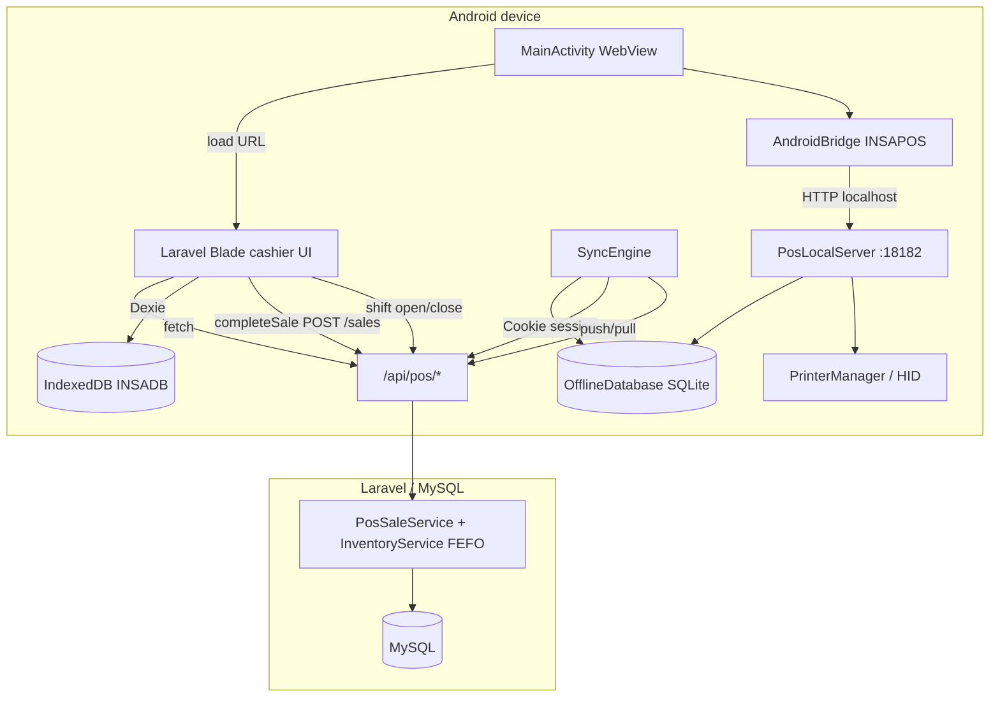
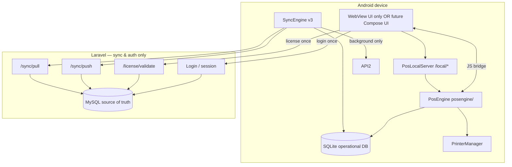

# INSAPOS Local POS Engine — Phase 1 Architecture Discovery

**Status:** Phase 1 complete — architecture map and gap analysis only.  
**Date:** 2026-05-28  
**Scope:** `INSAPOSv2/` (Android) + Laravel POS API (`routes/pos/api.php`)

---

## Executive summary

INSAPOSv2 today is a **WebView shell + hardware bridge**, not a self-contained POS engine. The cashier UI (`resources/views/pos/cashier/index.blade.php`) runs in Chromium, uses **IndexedDB** (`public/js/db.js`) as its primary offline store, and calls **cloud APIs** for checkout, shifts, and readings. Android provides **SQLite** (`OfflineDatabase.kt`), **background sync** (`SyncEngine.kt`), and **NanoHTTPD** (`PosLocalServer.kt` on port `18182`) mainly for catalog cache, transaction queueing, and printers/scanners.

The target architecture moves **all operational reads/writes** into a native **`posengine/`** module backed by SQLite, with the cloud used only for auth, license, and background sync.

---

## Phases 2–8 (high-level plan)

| Phase | Focus |
|-------|--------|
| **2 — Android POS engine (core)** | Add `posengine/` (`PosEngine`, cart, sale processor, local FEFO inventory, shift manager, receipt generator). Extend `OfflineDatabase` schema (v2+). Upgrade `AndroidBridge` + `PosLocalServer` with `/local/*` APIs. WebView becomes UI-only; business logic via bridge. |
| **3 — Cloud server adjustments** | Expand `sync/push` (sales, movements, shifts, receipts). Expand `sync/pull` deltas (products, categories, customers, `inventory_batches`, `expiry_alerts`, settings). Add `POST /api/pos/license/validate` (device fingerprint, branch slots). Ensure cloud never blocks live POS. |
| **4 — Sync engine v3** | Rewrite `SyncEngine.kt`: unified queue, exponential backoff, conflict types (price, stock, expiry), 10–15s background loop + reconnect/resume hooks, JS-visible status events. |
| **5 — Performance** | Zero network on sale path; all reads/writes SQLite + queue; eliminate duplicate IndexedDB hot path or demote it to cache-only. |
| **6 — Security & auth** | Login + license via cloud once; persist token/fingerprint/settings locally; mid-shift license grace (finish shift, block new shift). |
| **7 — Testing** | Kotlin unit tests (FEFO, shifts, receipts, queue), Laravel feature tests (idempotent push, pull deltas, conflicts), device offline/reconnect scenarios. |
| **8 — Deployment** | APK build, new migrations, backend deploy, validation checklist (offline sales, sync, licensing, INSABuddy). |

---

## Architecture maps

### Current: WebView → Cloud → DB



**Sale path today (simplified):**

1. Cashier adds items in Alpine.js UI (in WebView).
2. `completeSale()` writes to **IndexedDB**, then **POST `/api/pos/sales`** (online).
3. On failure, `sync-engine.js` or native `SyncEngine` **POST `/api/pos/sync/push`** later.
4. Server runs **FEFO `stockOut`** in `InventoryService` — not on device.
5. Receipt print via **INSABuddy client** → `127.0.0.1:18182` (or legacy `:18181`).

### Target: Android POS Engine → SQLite → Background sync → Cloud



---

## Gap analysis

| Component | Exists today | Missing for local engine |
|-----------|----------------|---------------------------|
| **Native POS UI** | No (`ui/` absent); WebView only | Optional native UI; at minimum UI must call `PosEngine` not cloud |
| **PosEngine module** | No | `PosEngine`, `PosCart`, `PosSaleProcessor`, `PosInventoryManager`, `PosShiftManager`, `PosReceiptGenerator` |
| **Local checkout** | Cloud `POST /api/pos/sales` + IndexedDB queue | Sale commit entirely in SQLite + sync queue |
| **Local FEFO** | Server-only `InventoryService::stockOut` | Mirror FEFO on device against `inventory_batches` |
| **Local shifts** | Cloud `shift/open`, `shift/close`, `shift/current` | `shifts` table + local open/close + push sync |
| **SQLite schema** | v1: products, customers, transactions_local, cart, sync_queue, receipts, settings, sync_log | categories, inventory_batches, stock_movements, pos_sales/items, shifts, expiry_alerts; DB migration strategy |
| **Sync push** | Transactions only; `cashier_id` optional in Kotlin builder | Batch payload: sales, movements, shifts, receipts; always include ids |
| **Sync pull** | Product aggregates + stock flags | Delta batches, categories, expiry_alerts, settings |
| **License API** | Device terminal register exists; no `/license/validate` | New endpoint + local cache of license + settings |
| **AndroidBridge** | Print, scan, branch, prefetch, stats | `getLocalProducts`, `createLocalSale`, shift/receipt/sync methods |
| **PosLocalServer** | `/offline/*` mirror + hardware | `/local/*` engine endpoints |
| **IndexedDB** | Full cashier offline (`db.js` v3) | Deprecate as source of truth or sync from SQLite |
| **INSABuddy** | Port 18181 companion; JS `detectV2()` → 18182 | Keep backup path; align transaction backup format |
| **X/Z readings** | Cloud-only | Policy: remain cloud or generate from local shift aggregates |
| **Rewards** | `SaleCompleted` event server-side | Define: sync triggers rewards on server when sale arrives |
| **Customer lookup QR** | Cloud lookup endpoints | Cache + local search; optional sync of lookup keys |
| **Stock-in / adjustments** | Cloud APIs | Out of scope for first engine cut unless queued |

---

## SQLite schema: current vs required

### Current (`OfflineDatabase.kt`, `DB_VERSION = 1`)

| Table | Purpose |
|-------|---------|
| `products` | Catalog cache (`server_id`, barcode, name, price, stock, `data_json`, …) |
| `customers` | Member cache |
| `transactions_local` | Pending sales (`local_id`, `items_json`, totals, `synced`) |
| `cart` | Session cart (unused by native engine today) |
| `sync_queue` | Generic actions (`action`, `table_name`, `payload`) |
| `receipts` | Receipt blobs linked to `transaction_local_id` |
| `settings` | Key/value (`last_pull_at`, `cache_ready`, …) |
| `sync_log` | Audit of pull/push cycles |

`onUpgrade()` is **empty** — schema changes need a careful v2 migration.

### Required (Phase 2 spec)

| Table | Notes |
|-------|--------|
| `products` | Extend: `category_id`, `sku`, `earliest_expiry`, `near_expiry`, `low_stock`, `out_of_stock` |
| `categories` | **New** — from `products/all` |
| `customers` | Align fields with API (`card_number`, `loyalty_points`, …) |
| `inventory_batches` | **New** — branch, product, batch_code, expiry, qty, cost |
| `stock_movements` | **New** — local ledger mirroring server types |
| `pos_sales` | **New** — replace/merge with `transactions_local` |
| `pos_sale_items` | **New** — normalized line items |
| `shifts` | **New** — local shift state + `server_id` after sync |
| `expiry_alerts` | **New** — pulled from server |
| `sync_queue` | Extend `entity_type` / versioning for multi-entity push |
| `receipts`, `settings`, `sync_log` | Keep; extend keys for license |

---

## API contract notes (idempotent sync)

### Authentication

- All `/api/pos/*` routes (except `ping`, `device-log`) use Laravel **web session** + cookies.
- Android `SyncEngine` passes `Cookie` from `CookieManager.getInstance().getCookie(baseUrl)`.
- Phase 6 may add **device token** for background sync without WebView — not present today.

### `POST /api/pos/sync/push` (existing)

**Request (sale):**

```json
{
  "local_id": "uuid",
  "branch_id": 1,
  "shift_id": 1,
  "cashier_id": 42,
  "member_id": null,
  "payment_method": "cash",
  "amount_tendered": 500.00,
  "items": [
    {
      "product_id": 10,
      "product_name": "Item",
      "sku": "SKU1",
      "barcode": "123",
      "qty": 2,
      "price": 100.00,
      "discount": 0
    }
  ],
  "created_at": "2026-05-28T10:00:00.000Z"
}
```

**Responses:**

| Case | Body |
|------|------|
| Success | `{ "success": true, "server_id": 99, "sale": {…} }` |
| Duplicate (idempotent) | `{ "success": true, "duplicate": true, "server_id": 99 }` |
| Price conflict | `{ "success": false, "conflict": [{ "field": "price", … }] }` |
| Validation / stock | `{ "success": false, "message": "…" }` |

**Gaps for Phase 3:**

- Push **stock_movements**, **shift** open/close events, **receipt** payloads in one or batched envelope.
- Include `device_fingerprint`, `client_seq`, `schema_version` for ordering.
- Return **inventory conflicts** (qty, expiry) not only price.
- Kotlin `buildPushPayload` currently omits `cashier_id` unless stored on transaction — **must be mandatory** for server validation.

### `GET /api/pos/sync/pull` (existing)

**Query:** `branch_id`, optional `since` (ISO timestamp).

**Response:**

```json
{
  "success": true,
  "products": [
    {
      "id": 10,
      "name": "…",
      "sku": "…",
      "barcode": "…",
      "price": 100,
      "stock": 50,
      "earliest_expiry": "2026-06-01",
      "near_expiry": false,
      "low_stock": false,
      "updated_at": "…"
    }
  ],
  "pulled_at": "2026-05-28T10:05:00+00:00"
}
```

**Does not return today:** `categories`, `inventory_batches[]`, `expiry_alerts[]`, `settings`.

### `GET /api/pos/products/all`

Full catalog + **categories** array; used by native `SyncEngine.pullProductCatalog`.

### `GET /api/pos/customers/all`

Customer list; native upsert maps `name` but not all loyalty fields into typed columns (stored in `data_json` only).

### `POST /api/pos/sales` (online cashier path)

Same validation as push via `StoreSaleRequest`; creates sale immediately. Target: **cashier stops calling this** during operations; only sync push.

### `POST /api/pos/license/validate` (planned Phase 3)

```json
// Request
{ "device_fingerprint": "…", "terminal_session_id": "…" }

// Response
{
  "allowed": true,
  "branch_id": 1,
  "company_id": 1,
  "pos_settings": { }
}
```

### Idempotency rules (recommended)

1. **Sales:** unique `local_id` on `pos_sales` / server `pos_sales.local_id`.
2. **Shifts:** `local_shift_id` UUID; server maps to `pos_shifts.id`.
3. **Movements:** composite key `(local_movement_id)` or `(sale_local_id, product_id, batch_id, seq)`.
4. **Pull:** monotonic `pulled_at` per entity type; client stores `inventory_last_sync`, `catalog_last_sync`, etc.
5. **Conflicts:** server wins for master data; client wins for tendered amounts only if policy allows — document per field.

---

## Key file reference

| Layer | Path |
|-------|------|
| SQLite | `INSAPOSv2/app/src/main/java/com/insapos/v2/db/OfflineDatabase.kt` |
| Sync | `INSAPOSv2/app/src/main/java/com/insapos/v2/sync/SyncEngine.kt` |
| Local HTTP | `INSAPOSv2/app/src/main/java/com/insapos/v2/PosLocalServer.kt` |
| WebView host | `INSAPOSv2/app/src/main/java/com/insapos/v2/MainActivity.kt` |
| JS bridge | `INSAPOSv2/app/src/main/java/com/insapos/v2/AndroidBridge.kt` |
| Foreground service | `INSAPOSv2/app/src/main/java/com/insapos/v2/PosService.kt` |
| Printers | `INSAPOSv2/app/src/main/java/com/insapos/v2/printers/PrinterManager.kt` |
| Cashier UI | `resources/views/pos/cashier/index.blade.php` |
| Web IndexedDB | `public/js/db.js`, `resources/js/sync-engine.js` |
| INSABuddy client | `resources/js/insabuddy.js` |
| POS routes | `routes/pos/api.php` |
| Sync controller | `app/Http/Controllers/POS/SyncController.php` |
| FEFO inventory | `app/Services/Inventory/InventoryService.php` |

---

## Risks and mitigations

### 1. WebView removal scope

**Risk:** Cashier UI is ~3000 lines of Alpine.js in Blade; “remove cloud dependency” is not a small JS edit.  
**Mitigation:** Phase 2 keeps WebView as **view**; incrementally replace `fetch('/api/pos/...')` with `INSAPOS.createLocalSale()` etc. Optional Phase 2b: Jetpack Compose shell.

### 2. Dual offline stores (IndexedDB + SQLite)

**Risk:** Data divergence, double sync, confusing bugs.  
**Mitigation:** Pick **SQLite as source of truth** on Android; IndexedDB becomes read-through cache fed from `PosLocalServer` or bridge, then retire direct Dexie writes.

### 3. SQLite migration safety

**Risk:** `onUpgrade` empty; production devices on v1.  
**Mitigation:** `DB_VERSION = 2` with explicit `ALTER`/copy migrations; backup before upgrade; feature flag `engine_version` in settings.

### 4. INSABuddy compatibility

**Risk:** Separate app on port **18181**; INSAPOS on **18182**; `sync-engine.js` still calls Buddy backup endpoints.  
**Mitigation:** Keep `INSABuddy.detectV2()` behavior; document shared transaction JSON schema; optional Buddy read-only mirror from SQLite export.

### 5. Server FEFO vs local FEFO drift

**Risk:** Local sale deducts batch A; server rejects or re-allocates on push.  
**Mitigation:** Pull `inventory_batches` before enabling local FEFO; push includes `batch_allocations[]`; server reconciles or returns `conflict` for cashier resolution.

### 6. `cashier_id` / auth on push

**Risk:** Native push without `cashier_id` fails validation (`SyncController` requires it).  
**Mitigation:** Persist `cashier_id` in settings at login; inject in every payload.

### 7. Rewards and fiscal readings

**Risk:** `SaleCompleted` only fires server-side; X/Z readings need server shift totals.  
**Mitigation:** Defer rewards to post-sync hook; readings remain cloud APIs until local aggregation exists.

### 8. License mid-shift

**Risk:** Blocking active shift hurts operations.  
**Mitigation:** Phase 6 policy — grace period per spec (finish shift, block new).

---

## Current vs target capability matrix

| Capability | Local today | Cloud-only today | Target |
|------------|-------------|------------------|--------|
| Product catalog browse | IndexedDB + partial SQLite | `products/all` on first load | SQLite |
| Stock / expiry flags | Aggregates in pull | Server calculates | SQLite batches + alerts |
| Cart / checkout logic | WebView JS | — | PosEngine |
| Payment capture | WebView | — | PosEngine |
| Inventory deduction | — | FEFO on server | Local FEFO + sync |
| Shift open/close | — | API | Local + sync |
| Receipt print | PrinterManager | — | Unchanged (local) |
| Sale persistence | IndexedDB + SQLite queue | `/sales` immediate | SQLite only |
| Login / session | WebView cookies | Laravel auth | Cloud once |
| License | Terminal register | — | New validate API |
| Background sync | JS + Kotlin (parallel) | — | SyncEngine v3 only |

---

## Implementation status (2026-05-28)

Phases 2–9 implemented. See [INSAPOS_PHASES_2_9_DEPLOY.md](./INSAPOS_PHASES_2_9_DEPLOY.md).
