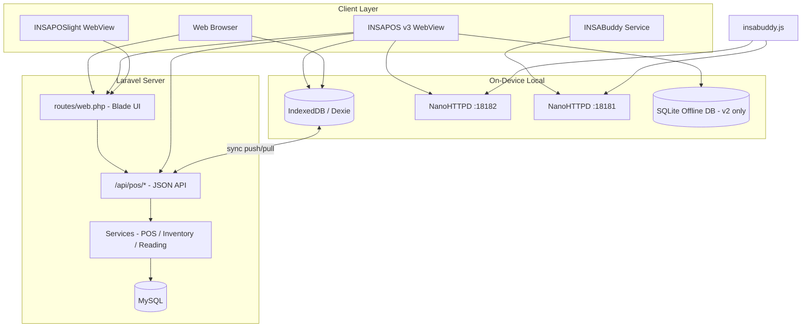

# INSA POS — System Report

**Document version:** 1.0  
**Date:** May 27, 2026  
**Repository:** INSA_POS (Laravel + Android companion apps)  
**Production URL:** https://insapos.diybizrewards.com  

---

## Table of Contents

1. [Part A — Executive Summary](#part-a--executive-summary-for-clients)
2. [Part B — Features Overview](#part-b--features-overview)
3. [Part C — Technical Overview](#part-c--technical-overview-for-developers)
4. [Part D — Project Structure](#part-d--project-structure-files--folders)
5. [Part E — Integration Points for App Developers](#part-e--integration-points-for-app-developers)
6. [Part F — Deployment & Operations](#part-f--deployment--operations)

---

## Part A — Executive Summary (for Clients)

### What INSA POS Is

**INSA POS** is a cloud-hosted, branch-aware point-of-sale platform built for Philippine retail and food service businesses. Cashiers run sales through a modern web interface (browser or Android wrapper), while owners and managers use a back office for products, inventory, shifts, analytics, and compliance-style **X/Z readings**. The system is designed to keep selling when connectivity is weak: transactions can be recorded locally and synchronized when the network returns.

### Key Features and Business Benefits

| Capability | Business benefit |
|------------|----------------|
| **Offline-first POS** | Continue checkout during outages; sales sync when online |
| **Multi-branch** | Central catalog with per-branch stock and reporting |
| **Inventory batches & expiry** | Track lots, FEFO consumption, and expiry alerts (30-day / 7-day / expired) |
| **Licensing (Super Admin)** | Control how many POS terminals each branch may run |
| **Analytics & shift tools** | Sales trends, shift variance, audit trails, CSV/PDF exports |
| **BIR-style X/Z readings** | Mid-shift (X) and end-of-day (Z) reading reports for reconciliation |
| **Cafe vs retail modes** | Grid ordering for restaurants; barcode-first flow for retail |
| **Android apps** | Full-featured **INSAPOS v3** (`INSAPOSv2/` module), lightweight **INSAPOSlight**, hardware **INSABuddy** |
| **Customer / loyalty hooks** | Member lookup and rewards integration points on the web POS |
| **Device logging** | Remote diagnostics from Android terminals |

### Who It's For

| Role | Typical use |
|------|-------------|
| **Cashier** | `/pos/cashier` — take orders, payments, receipts |
| **Stockman** | Stock in/out, inventory views |
| **Manager** | Back office (read-mostly settings), shifts, inventory reports |
| **Admin / Owner** | Products, categories, branches, users, POS settings |
| **Super Admin** | Cross-tenant licenses and branch monitoring |

**Business modes:** On first launch, cashiers choose **Cafe/Resto** (product grid) or **Retail** (scan/type barcode). The choice persists in browser local storage (`insapos_mode`).

### Deployment

| Item | Detail |
|------|--------|
| **Live site** | https://insapos.diybizrewards.com |
| **Hosting** | Laravel Forge (PHP application server, MySQL, scheduled tasks) |
| **Source control** | GitHub repository; `main` branch deploys web app and triggers Android CI |
| **Android builds** | GitHub Actions workflow `build-android.yml` produces debug/release APK artifacts |

---

## Part B — Features Overview

### Web POS (Cashier)

- **Route:** `GET /pos/cashier` (roles: cashier, manager, admin, owner)
- **UI:** Alpine.js SPA embedded in `resources/views/pos/cashier/index.blade.php`
- **Modes:**
  - **Cafe/Resto:** Category grid; tap products to add to cart
  - **Retail:** Barcode scan or search; optional preview-before-add
- **Offline:** Dexie/IndexedDB (`public/js/db.js`) caches products, customers, local transactions; `public/js/sync-engine.js` pings server and pushes/pulls on interval (~15s)
- **Hardware:** `public/js/insabuddy.js` talks to INSABuddy (port **18181**) or INSAPOS v3 built-in server (port **18182**) for print, drawer, scan
- **Shifts:** Open/close via `/api/pos/shift/*`
- **Payments:** Cash, cards, GCash, Maya, PalawanPay, other (validated server-side on sync)
- **Readings:** X/Z via `/api/pos/x-reading` and `/api/pos/z-reading`

### Back Office

| Area | Routes (prefix) | Highlights |
|------|-----------------|------------|
| Dashboard | `/backoffice` | KPIs, shift summary widgets |
| Analytics | `/backoffice/analytics` | Chart.js charts, product drill-down |
| Shifts | `/backoffice/shifts/*` | List, dashboard, variance, audit, PDF/CSV export |
| Readings | `/backoffice/readings/x`, `z` | Printable X/Z reports + CSV export |
| Inventory | `/backoffice/inventory/*` | Stock levels, movements, inventory & expiry reports, stock in/out |

### Admin (Branch Operations)

- **Products & categories:** CRUD, Excel import/export (`maatwebsite/excel`)
- **Branches & users:** Branch assignment, role-based users
- **Inventory dashboard:** Low-stock / batch visibility at `/admin/inventory`
- **POS settings:** Store name, receipt options, tax/display flags (`/pos/settings`)
- **Device logs:** `/insaposlogs` — Android-forwarded diagnostics

### Super Admin

- **Dashboard:** Cross-branch overview
- **Licenses:** `pos_slots`, active window per branch (`PosLicense` model)
- **Branches:** Monitor branch health and drill into branch detail

### Stockman Module

Dedicated UI under `/stockman`:

- Inventory overview
- Stock in / stock out forms (batch-aware via `InventoryService`)

### Android Applications — When to Use Each

| App | Package | Version (build.gradle) | Use when |
|-----|---------|------------------------|----------|
| **INSAPOS v3** | `com.insapos.v2` | **3.0.1** (versionCode 24) | **Recommended** full POS terminal: WebView + foreground service, NanoHTTPD on **18182**, native offline DB, printer/scanner bridge, barcode events |
| **INSAPOSlight** | `com.insapos.light` | **1.0a** (versionCode 1) | Minimal WebView shell; online-focused (`INSAPOS_OFFLINE_CAPABLE = false`); no local hardware server |
| **INSABuddy** | `com.insapos.insabuddy` | **1.3.0** (versionCode 3) | Standalone hardware companion: thermal printer, cash drawer, scanner on port **18181** while any browser/WebView loads the web POS |
| **INSAPOS** (legacy) | `com.insapos.posapp` | 1.0.0 | Older WebView wrapper; superseded by v2 for new deployments |

**Typical setup:** Install **INSAPOS v3** on the cashier tablet *or* use **INSAPOSlight** + **INSABuddy** on separate devices if you split hardware from display.

### Inventory System (Batches, FEFO, Expiry)

- **`inventory_batches`:** Per-branch lots with optional `batch_code`, `expiry_date`, `quantity`, `cost_price`
- **FEFO:** `InventoryService::stockOut()` deducts from batches ordered by earliest expiry (`scopeFefoOrder`)
- **Movements:** `stock_movements` audit trail (stock_in, sale, adjustment, etc.)
- **Alerts:** Daily scheduler runs `inventory:scan-expiry` → creates idempotent `expiry_alerts` for 30-day, 7-day, and expired batches
- **POS stock display:** Sync pull aggregates non-expired batch quantities per product for the active branch

---

## Part C — Technical Overview (for Developers)

### Technology Stack

| Layer | Technology | Version / notes |
|-------|------------|-----------------|
| Backend framework | Laravel | **^13.8** (`composer.json`) |
| Language | PHP | **^8.3** |
| Database | MySQL (production), SQLite (local dev) | Via Laravel `.env` |
| PDF (server) | barryvdh/laravel-dompdf | ^3.1 — shift/report PDFs |
| Excel | maatwebsite/excel | ^3.1 — product import/export |
| Frontend (POS) | Alpine.js 3, Tailwind CSS (CDN) | Cashier blade |
| Build tooling | Vite 8, Tailwind 4 | `package.json` — welcome/assets pipeline |
| Offline storage | Dexie.js 4 | IndexedDB database name `insapos` |
| Charts | Chart.js 4 | Back-office analytics |
| Android | Kotlin, WebView, NanoHTTPD 2.3.1 | API 23–35, JDK 17 |

### Architecture Diagram



**Request flow (online sale):** Cashier UI → optional local queue in IndexedDB → `POST /api/pos/sync/push` → `PosSaleService` → `inventory_batches` deduction (FEFO) + `pos_sales` / items.

### API Structure (`/api/pos/*`)

Registered in `bootstrap/app.php`:

```php
Route::middleware(['web', 'auth'])
    ->prefix('api/pos')
    ->group(base_path('routes/pos/api.php'));
```

Uses **web middleware** (session cookies + CSRF). CSRF exceptions: `device-log`, `ping`, `sync/*`.

| Method | Endpoint | Auth | Purpose |
|--------|----------|------|---------|
| GET | `/api/pos/ping` | No | Connectivity check |
| POST | `/api/pos/sync/push` | Yes | Idempotent sale upload (`local_id`) |
| GET | `/api/pos/sync/pull` | Yes | Product delta + branch stock |
| GET | `/api/pos/customers/all` | Yes | Customer cache for offline |
| POST | `/api/pos/sales` | Yes | Direct sale (online) |
| GET | `/api/pos/products/all`, `/search` | Yes | Product lookup |
| GET/POST | `/api/pos/shift/*` | Yes | Shift open/close/current |
| POST | `/api/pos/x-reading`, `/z-reading` | Yes | Generate readings |
| POST | `/api/pos/device-log` | No | Android log ingest |

### Offline-First: IndexedDB and SyncEngine

**`public/js/db.js` (INSADB)**

- Dexie schema v2: `products`, `customers`, `categories`, `cart`, `transactions_local`, `sync_queue`, `receipts`, `settings`
- UUID `local_id` for idempotent server sync

**`public/js/sync-engine.js`**

- Polls `/api/pos/ping` (3s timeout)
- Pushes pending transactions to `/api/pos/sync/push`
- Pulls `/api/pos/sync/pull?branch_id=&since=`
- Emits `connectivity` and `syncStatus` events for UI badges

**Conflict handling:** Server compares item prices on push; returns `conflict` array if local price ≠ server price.

### Android Integration Summary

| Component | Mechanism |
|-----------|-----------|
| JS bridge name | `window.INSAPOS` (`@JavascriptInterface` / `addJavascriptInterface`) |
| Device payload | `window.INSAPOS_DEVICE`, `insapos:ready` event |
| Service port | `window.INSAPOS_SERVICE_PORT` (18182 on v2) |
| Barcode callback | `window.onINSAPOSBarcode(code)` |
| Connectivity | `window.onINSAPOSConnectivity(online)` |
| Cookies | WebView shares Laravel session cookie with hosted origin |

---

## Part D — Project Structure (Files & Folders)

```
INSA_POS/
├── app/                         # Laravel application code
│   ├── Console/Commands/        # Artisan commands (incl. inventory:scan-expiry)
│   ├── Http/
│   │   ├── Controllers/
│   │   │   ├── Admin/           # Products, categories, branches, users, inventory dash
│   │   │   ├── Auth/            # LoginController (session auth)
│   │   │   ├── Backoffice/      # Analytics, shifts, inventory reports
│   │   │   ├── POS/             # Sync, sales, shift, readings, settings, lookups
│   │   │   ├── Stockman/        # Stock in/out UI
│   │   │   └── SuperAdmin/      # Licenses, branch overview
│   │   ├── Middleware/
│   │   │   └── CheckRole.php    # Role gate; super_admin bypasses lists
│   │   └── Requests/POS/        # StoreSaleRequest, StoreStockInRequest
│   ├── Models/
│   │   ├── POS/                 # Product, Branch, PosSale, PosShift, readings, etc.
│   │   ├── Inventory/           # InventoryBatch, StockMovement, ExpiryAlert
│   │   ├── Rewards/             # Loyalty / wallet (rewards engine hooks)
│   │   └── User.php             # Roles: super_admin, owner, admin, manager, cashier, stockman
│   ├── Services/
│   │   ├── POS/                 # PosSaleService, ShiftService, StockInService, …
│   │   ├── Inventory/           # InventoryService (FEFO stock out, stock in)
│   │   ├── ReadingService.php   # X/Z reading generation
│   │   └── Rewards/             # RewardsEngineService
│   └── Imports/                 # ProductsImport (Excel)
├── bootstrap/app.php            # Routes web + api/pos group; CSRF exceptions
├── database/migrations/         # 35 migrations (POS core + inventory batches May 2026)
├── resources/views/             # Blade templates by module (pos, backoffice, admin, …)
├── public/js/                   # db.js, sync-engine.js, insabuddy.js, json-viewer.js
├── routes/
│   ├── web.php                  # All UI routes + role middleware
│   ├── console.php              # Scheduler: inventory:scan-expiry daily
│   └── pos/api.php              # /api/pos/* JSON endpoints
├── INSAPOSv2/                   # Full Android POS (INSAPOS v3 branding, v3.0.1)
├── INSAPOSlight/                # Lite WebView (1.0a)
├── INSABuddy/                   # Hardware companion (1.3.0)
├── INSAPOS/                     # Legacy WebView (1.0.0)
├── .github/workflows/           # build-android.yml — APK CI on main
└── docs/                        # Project documentation (this report)
```

### `app/Http/Controllers/` (POS-relevant)

| Folder | Key controllers |
|--------|-----------------|
| `POS/` | `SyncController`, `PosSaleController`, `ShiftController`, `ReadingController`, `PosSettingsController`, `ProductLookupController`, `CustomerLookupController`, `StockInController` |
| `Admin/` | `ProductController`, `CategoryController`, `BranchController`, `UserManagementController`, `InventoryDashboardController`, `DashboardController` |
| `Backoffice/` | `AnalyticsController`, `ShiftManagementController`, `ShiftDashboardController`, `ShiftVarianceController`, `ShiftAuditController`, `ShiftExportController`, `InventoryStockController`, `InventoryMovementController`, `InventoryReportController`, `InventoryAdjustmentController` |
| `Stockman/` | `StockmanController` |
| `SuperAdmin/` | `DashboardController`, `LicenseController`, `BranchOverviewController` |
| Root | `DeviceLogController`, `Auth/LoginController` |

### `app/Models/` (core)

| Model | Role |
|-------|------|
| `POS/Product`, `Category`, `Branch` | Catalog |
| `POS/PosSale`, `PosSaleItem` | Transactions |
| `POS/PosShift`, `ShiftAuditLog`, `PosShiftAudit` | Cashier shifts |
| `POS/PosXReading`, `PosZReading` | BIR-style readings |
| `POS/PosLicense` | Branch terminal licensing |
| `POS/PosSetting` | Store configuration key-value |
| `POS/Customer` | Member lookup |
| `Inventory/InventoryBatch` | Batch/lot stock |
| `Inventory/StockMovement` | Audit trail |
| `Inventory/ExpiryAlert` | Expiry notifications |
| `DeviceLog` | Android remote logs |

### `app/Services/`

| Service | Responsibility |
|---------|------------------|
| `POS/PosSaleService` | Sale creation, stock deduction |
| `POS/ShiftService` | Shift lifecycle |
| `POS/StockInService` | POS-side stock in API |
| `POS/PosSettingsService` | Settings read/update |
| `POS/CustomerLookupService` | Member search |
| `Inventory/InventoryService` | Batch stock in/out, FEFO |
| `ReadingService` | X/Z reading totals |
| `Rewards/RewardsEngineService` | Loyalty accrual hooks |

### `database/migrations/` (highlights)

| Migration | Creates / alters |
|-----------|------------------|
| `create_branches_table` | Multi-branch |
| `create_products_table`, `categories` | Catalog |
| `create_pos_sales_table`, `pos_sale_items` | Sales + `local_id` for sync |
| `create_pos_shifts_table`, audit tables | Shifts |
| `create_pos_x_readings`, `pos_z_readings` | Readings |
| `create_pos_licenses_table` | Licensing |
| `create_inventory_batches_table` | Batch inventory |
| `create_expiry_alerts_table` | Expiry monitoring |
| `create_stock_movements_table` | Movement log |

### `resources/views/`

| Path | Purpose |
|------|---------|
| `pos/cashier/index.blade.php` | Main POS SPA |
| `pos/settings/` | Store settings form |
| `backoffice/` | Dashboard, analytics, shifts, readings, inventory |
| `admin/` | Products, categories, users, branches, device logs |
| `stockman/` | Stockman workflows |
| `super-admin/` | Licenses, branch monitor |
| `auth/login.blade.php` | Session login |
| `layouts/*.blade.php` | Tailwind layouts per role |

### `public/js/`

| File | Purpose |
|------|---------|
| `db.js` | Dexie/IndexedDB `INSADB` API |
| `sync-engine.js` | Online detection + push/pull orchestration |
| `insabuddy.js` | Hardware bridge client (ports 18181/18182) |
| `json-viewer.js` | Device log JSON viewer |

### `routes/`

| File | Purpose |
|------|---------|
| `web.php` | UI routes with `auth` + `role:` middleware |
| `pos/api.php` | JSON API under `/api/pos` |
| `console.php` | `Schedule::command('inventory:scan-expiry')->daily()` |

### Android projects

| Directory | Notable files |
|-----------|---------------|
| `INSAPOSv2/` | `MainActivity.kt`, `PosService.kt`, `PosLocalServer.kt` (port 18182), `AndroidBridge.kt`, `sync/SyncEngine.kt`, `db/OfflineDatabase.kt` |
| `INSABuddy/` | `LocalServer.kt` (port 18181), `PrinterManager`, scanner bridges |
| `INSAPOSlight/` | Minimal `MainActivity.kt`, `JsBridge` as `INSAPOS` |
| `INSAPOS/` | Legacy WebView shell |

### `.github/workflows/build-android.yml`

On push to `main` (or manual dispatch), builds debug APKs for INSABuddy, INSAPOS, INSAPOS v3 (`INSAPOSv2/` module; debug + release unsigned), and INSAPOSlight; uploads artifacts (90-day retention).

---

## Part E — Integration Points for App Developers

### WebView ↔ Web (`window.INSAPOS`)

**INSAPOS v3** injects on page load (simplified):

```javascript
window.INSAPOS_DEVICE = { /* device JSON */ };
window.INSAPOS_SERVICE_PORT = 18182;
window.INSAPOS_OFFLINE_CAPABLE = true;
window.INSAPOS_ONLINE = true|false;
// Bridge methods: getDeviceInfo(), printReceipt(json), openDrawer(),
//   scanBarcode(), getPrinterStatus(), getServicePort(), getOfflineStats(), triggerSync()
```

**INSAPOSlight** exposes a smaller `INSAPOS` bridge and sets `INSAPOS_OFFLINE_CAPABLE = false`.

**Session:** WebView loads `https://insapos.diybizrewards.com` (or staging URL); Laravel session cookie authenticates `/api/pos/*` calls from JavaScript `fetch` with `X-CSRF-TOKEN` from `<meta name="csrf-token">`.

### INSABuddy HTTP API (port 18181)

Base: `http://127.0.0.1:18181`

| Endpoint | Method | Description |
|----------|--------|-------------|
| `/ping` | GET | Health + printer connected flag |
| `/print` | POST | `{ "data": "<base64>" }` or `{ "text": "..." }` |
| `/drawer/open` | POST | Open cash drawer |
| `/scan` | POST | Trigger camera scan |
| `/scan/hid` | GET | HID scanner buffer |
| `/device/info` | GET | Device metadata |
| `/printer/status`, `/printer/list`, `/printer/select` | GET/POST | Printer management |
| `/receipt/save`, `/transaction/save` | POST | Offline cache files |
| `/sync/push`, `/sync/pull` | POST/GET | Buddy-local sync helpers |

CORS: `Access-Control-Allow-Origin: *` on responses.

### INSAPOS v3 Local Server (port 18182)

Base: `http://127.0.0.1:18182` (bound to localhost only)

| Endpoint | Description |
|----------|-------------|
| `/ping` | `{ "ok": true, "app": "INSA POS v3", "port": 18182 }` |
| `/device/info` | Device + app version |
| `/print`, `/drawer/open` | Same semantics as Buddy |
| `/printer/status`, `/printer/list`, `/printer/select` | Printer routing |
| `/scan`, `/scan/hid` | Camera / HID barcode |
| `/offline/products`, `/offline/products/barcode` | SQLite-backed catalog |
| `/offline/customers` | Cached customers |
| `/offline/transaction`, `/offline/receipt` | Persist offline sale |
| `/offline/stats`, `/offline/sync/status`, `/offline/sync/now` | Native sync engine control |

`insabuddy.js` calls `INSABuddy.detectV2()` to repoint `BASE_URL` from 18181 → 18182 when `window.INSAPOS` exists.

### Authentication / Session

| Concern | Implementation |
|---------|----------------|
| Login | `POST /login` — email/password, `Auth::attempt`, session regenerate |
| Role redirect | Super admin → super-admin dashboard; backoffice roles → `/backoffice`; stockman → stockman; else cashier |
| API auth | Same session cookie on `/api/pos/*` (not Sanctum token for POS JS) |
| CSRF | Required on mutating routes except ping, sync/*, device-log |

### Sync API Endpoints (server)

| Endpoint | Body / query | Notes |
|----------|--------------|-------|
| `POST /api/pos/sync/push` | Full sale + `local_id` | Idempotent; price conflict detection |
| `GET /api/pos/sync/pull` | `branch_id`, optional `since` | Products with batch-aggregated `stock` |
| `GET /api/pos/customers/all` | — | Full customer list for cache |

---

## Part F — Deployment & Operations

### Laravel Forge

Typical Forge setup for **insapos.diybizrewards.com**:

1. Connect GitHub repo; deploy `main` on push
2. **Deploy script:** `composer install --no-dev`, `php artisan migrate --force`, `php artisan config:cache`, `php artisan route:cache`, `npm run build` (if asset pipeline used)
3. **Scheduler:** Forge cron runs `php artisan schedule:run` every minute → executes `inventory:scan-expiry` daily
4. **Queue:** Optional `php artisan queue:listen` for async jobs (composer `dev` script includes queue worker)
5. **Environment:** `.env` with `APP_URL`, DB credentials, `APP_KEY`

### Environment Requirements

| Requirement | Version |
|-------------|---------|
| PHP | 8.3+ |
| Composer | 2.x |
| MySQL | 8.x recommended |
| Node.js | 18+ (Vite build) |
| SSL | Required for production WebView cookies |

### GitHub Actions (APK builds)

Workflow: `.github/workflows/build-android.yml`

- **Trigger:** Push to `main` affecting Android folders, or `workflow_dispatch`
- **JDK:** 17 (Temurin)
- **SDK:** Android 35, build-tools 35.0.0
- **Artifacts:** Debug APKs (all apps); INSAPOS v3 (`INSAPOSv2/` module) also uploads unsigned release APK

### Operational Commands

```bash
# Migrations
php artisan migrate --force

# Expiry scan (also scheduled daily)
php artisan inventory:scan-expiry

# Health check
curl https://insapos.diybizrewards.com/up
```

---

## Document History

| Date | Version | Notes |
|------|---------|-------|
| May 27, 2026 | 1.0 | Initial client + developer system report |

---

*INSA POS — prepared for client distribution and third-party developer onboarding.*
