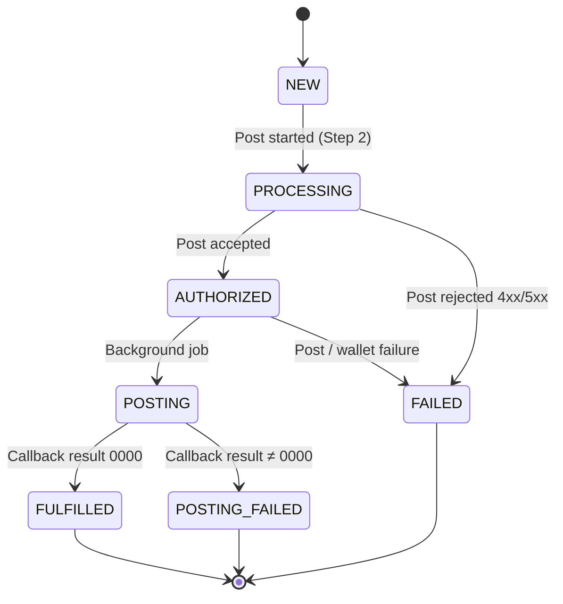
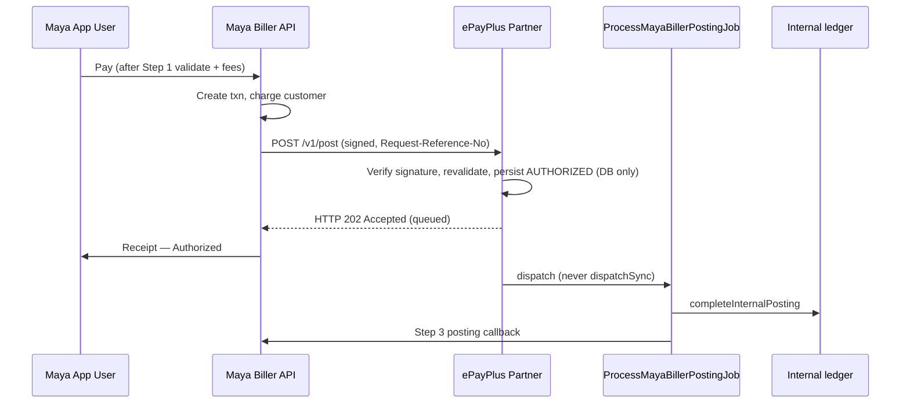

# Maya Partner Biller API — ePayPlus

ePayPlus acts as **Partner Biller**. Maya sends inbound Validate / Post / Inquire; ePayPlus posts the bill internally and sends **Posting Callbacks** (Step 3) to Maya.

**Base URL (production example):** `https://epayplus.diybizrewards.com`

All inbound routes are prefixed with `/api/maya-biller/v1`.

Required headers (inbound from Maya):

| Header | Required | Description |
|--------|----------|-------------|
| `Request-Reference-No` | Yes | Unique idempotency key per Maya request |
| `paymaya-signature` | Base64(SHA256(raw body + secret key)) |
| `Content-Type` | Yes | `application/json` |

Set `MAYA_BILLER_SKIP_SIGNATURE=true` in local `.env` for testing only.

---

## Transaction state machine



| State | When | Partner action |
|-------|------|----------------|
| **NEW** | Step 1 Validate success (Maya-side; partner validate does **not** persist) | Return `0000` + fees only |
| **PROCESSING** | Step 2 Post started | Receive post, queue job |
| **AUTHORIZED** | Maya debited customer wallet | Set on post accept |
| **POSTING** | Internal bill posting running | Save txn, run `ProcessMayaBillerPostingJob` |
| **FAILED** | Wallet debit / post failed | Return 4xx/5xx on post (do not queue) |
| **FULFILLED** | Step 3 callback `result.code` = **0000** | Partner **sends** callback to Maya |
| **POSTING_FAILED** | Callback `result.code` ≠ **0000** | Maya refunds customer |

Flow: START → New → Processing → Authorized → Posting → Fulfilled | Failed | Posting Failed → END

---

## Step 1: Validate Bills Payment

**Maya spec path:** `POST /v1/validate`  
**ePayPlus URL:** `POST /api/maya-biller/v1/validate`

**Behavior:** Stateless — **no database writes**. Successful validates store an RRN proof in cache for Post gating.

### Sample request

```http
POST /api/maya-biller/v1/validate HTTP/1.1
Host: epayplus.diybizrewards.com
Content-Type: application/json
Request-Reference-No: RRN-20260527-000001
paymaya-signature: <computed>

{
  "billerCode": "MERALCO",
  "accountNumber": "1234567890",
  "amount": 1500.00,
  "currency": "PHP",
  "customerPhone": "09171234567",
  "data": {}
}
```

### Sample success response

```json
{
  "result": { "code": "0000" },
  "fees": {
    "convenienceFee": 0,
    "serviceFee": 5,
    "totalFee": 5
  }
}
```

### Result codes (whitelist)

| Code | Customer-facing | When used |
|------|-----------------|-----------|
| `0000` | No | Valid |
| `2559` | Yes | Invalid biller / account |
| `2596` | Yes | Invalid amount, mobile, billing data |
| `ACQ018` | No | Signature, disabled, maintenance |

---

## Step 2: Post Bills Payment (ExecutePost)

**Maya spec path:** `POST /v1/post`  
**ePayPlus URL:** `POST /api/maya-biller/v1/post`

Maya debits the customer wallet, then calls partner Post with `callbackUrl` for Step 3.

### Sequence (Bills Pay Direct ExecutePost)



> **⚠️ CRITICAL — respond before posting completes**  
> Return **HTTP 2xx within milliseconds** (SLA **&lt; 3 seconds**, target sub-second). Do **not** run internal biller posting or Maya’s posting callback inside the Post HTTP request. Slow handlers cause Maya timeouts (`503`, `504`, `598`, `599`) and retries. Posting and Step 3 run in **`ProcessMayaBillerPostingJob`** on the queue.

| HTTP status | Maya meaning |
|-------------|----------------|
| **2xx** (default **202**) | Received and **queued** |
| **503 / 504 / 598 / 599** | Partner timeout — Maya retries |
| **Other 4xx / 5xx** | **POSTING FAILED** at Maya |

### Sample request

```json
{
  "billerCode": "MERALCO",
  "accountNumber": "1234567890",
  "amount": 1500.00,
  "fee": 5.00,
  "currency": "PHP",
  "transactionId": "MAYA-TXN-12345",
  "callbackUrl": "https://pg-sandbox.paymaya.com/partners/v1/billers/transactions/callback"
}
```

### Sample acceptance response (HTTP 202)

```json
{
  "resultCode": "0000",
  "resultMessage": "ACCEPTED",
  "requestReferenceNo": "RRN-20260527-000002",
  "transactionId": "MAYA-TXN-12345",
  "status": "AUTHORIZED",
  "queued": true
}
```

Duplicate `Request-Reference-No` returns **202** with `resultMessage`: `ALREADY_ACCEPTED` and `queued`: false (no second job).

Partner persists txn as **PROCESSING → AUTHORIZED**, creates ledger row (DB only), and dispatches `App\Jobs\MayaBiller\ProcessMayaBillerPostingJob`.

---

## Step 3: Send Posting Callback (Partner → Maya)

**Partner initiates** HTTP `POST` to `callbackUrl` from the Post request (fallback: `MAYA_BILLER_*_BASE_URL` + `MAYA_BILLER_CALLBACK_PATH`).

| Item | Value |
|------|-------|
| Auth | `Authorization: Basic Base64(apiKey + ":")` — password empty |
| Header | `Request-Reference-No: [RRN]` |
| Body | `result.code` **0000** = FULFILLED; other = POSTING_FAILED (Maya refunds) |

### Sample callback payload (success)

```http
POST /partners/v1/billers/transactions/callback HTTP/1.1
Host: pg-sandbox.paymaya.com
Authorization: Basic <base64(apiKey + ":")>
Request-Reference-No: RRN-20260527-000001
Content-Type: application/json

{
  "requestReferenceNo": "RRN-20260527-000001",
  "transactionId": "MAYA-TXN-12345",
  "result": {
    "code": "0000"
  }
}
```

### Sample callback payload (posting failed)

```json
{
  "requestReferenceNo": "RRN-20260527-000001",
  "transactionId": "MAYA-TXN-12345",
  "result": {
    "code": "9999"
  }
}
```

Implementation: `App\Services\MayaBiller\MayaBillerCallbackClient::sendPostingCallback()` returns `MayaCallbackResult`; `MayaBillerTransactionService::applyCallbackResult()` sets **FULFILLED** or **POSTING_FAILED** and logs `callback_sent_at` / `callback_response`.

### Job sequence (`ProcessMayaBillerPostingJob`)

1. Transition **AUTHORIZED → POSTING**
2. Credit / complete internal `epay_transactions` row (`markSuccess`)
3. `POST` callback with `result.code` **0000** → **FULFILLED**
4. On internal or callback business failure → callback **9999** → **POSTING_FAILED**

---

## Inquire Transaction

**Maya spec path:** `POST /v1/inquire`  
**ePayPlus URL:** `POST /api/maya-biller/v1/inquire`

```json
{
  "requestReferenceNo": "RRN-20260527-000001"
}
```

### Sample response

```json
{
  "result": { "code": "0000" },
  "requestReferenceNo": "RRN-20260527-000001",
  "transactionId": "MAYA-TXN-12345",
  "status": "FULFILLED",
  "amount": 1500,
  "fee": 5,
  "currency": "PHP",
  "callbackSentAt": "2026-05-27T10:15:00+08:00"
}
```

---

## Settlement reports

Download settlement reports from **Maya Business Manager** ([business.maya.ph](https://business.maya.ph)) and reconcile against **FULFILLED** transactions in ePayPlus admin (**Integrations → Maya Biller**).

Settlement lines include:

- Bill payment amount
- **Service fee** and **convenience fee** (must match Validate / commercial contract)

Configure fees in `config/maya_biller.php` → `fees.default` and `fees.biller_overrides`.

---

## Get Fee (optional)

`POST /api/maya-biller/v1/fee` — same fee shape as Validate success.

---

## Local testing

```bash
BODY='{"billerCode":"MERALCO","accountNumber":"1234567890","amount":1500,"currency":"PHP"}'
SECRET="your-maya-secret"
SIG=$(php -r "echo base64_encode(hash('sha256', file_get_contents('php://stdin').'$SECRET', true));" <<< "$BODY")

curl -s -X POST "http://localhost/api/maya-biller/v1/validate" \
  -H "Content-Type: application/json" \
  -H "Request-Reference-No: test-rrn-001" \
  -H "paymaya-signature: $SIG" \
  -d "$BODY"
```

```env
MAYA_BILLER_ENABLED=true
MAYA_BILLER_SECRET_KEY=your-secret
MAYA_BILLER_CALLBACK_API_KEY=your-callback-key
MAYA_BILLER_SKIP_SIGNATURE=true
```

Admin UI: **ePayPlus → Integrations → Maya Biller** (`/epayplus/integrations/maya`).
