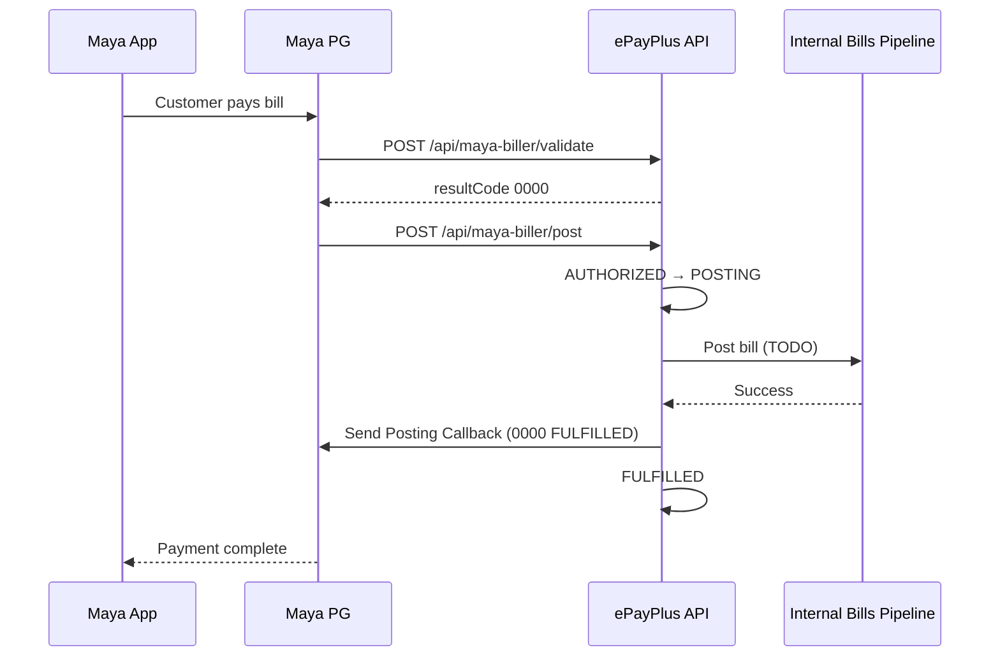

# Maya Partner Biller API — ePayPlus Integration

ePayPlus acts as **Partner Biller** in the Maya Bills Payment network. Maya’s consumer app debits the customer; ePayPlus validates the account, posts the bill on the partner side, and sends a **Posting Callback** to confirm fulfillment or failure (refund path).

> **Status:** Scaffolding only. Integration is **disabled** by default until Maya onboarding provides credentials.

## Feature scope (ePayPlus)

| Direction | Endpoint | Purpose |
|-----------|----------|---------|
| Inbound | Validate Bills Payment | Validate customer payment details from Maya app |
| Inbound | Post Bills Payment | Customer debited; partner must credit/post |
| Inbound | Inquire Transaction | Status check by Request Reference No |
| Outbound | Send Posting Callback | Confirm `FULFILLED` (`0000`) or failure |
| Inbound (optional) | Get Fee | Return fee amount |

Android/kiosk **Bills** UI remains for retailer-initiated payments. **Maya consumer** bill pay is **server-side** only (no Android SDK for Partner Biller).

## Public URLs (register with Maya RM)

Base: `{APP_URL}/api/maya-biller`

| Method | Path | Controller action |
|--------|------|-------------------|
| POST | `/validate` | `validatePayment` |
| POST | `/post` | `postPayment` |
| POST | `/inquire` | `inquireTransaction` |
| POST | `/fee` | `getFee` (optional) |

Admin status page: `{APP_URL}/epayplus/integrations/maya`

## Environment variables

| Variable | Description |
|----------|-------------|
| `MAYA_BILLER_ENABLED` | `true` to enforce signature verification and accept traffic |
| `MAYA_BILLER_SECRET_KEY` | Inbound webhook signature secret (from Maya) |
| `MAYA_BILLER_CALLBACK_API_KEY` | Outbound callback API key (Basic auth username, empty password) |
| `MAYA_BILLER_ENVIRONMENT` | `sandbox` or `production` |
| `MAYA_BILLER_SANDBOX_BASE_URL` | Maya PG sandbox base URL |
| `MAYA_BILLER_PRODUCTION_BASE_URL` | Maya PG production base URL |
| `MAYA_BILLER_CALLBACK_PATH` | Relative path for posting callback |
| `MAYA_BILLER_DEFAULT_CURRENCY` | Default `PHP` |
| `MAYA_BILLER_HTTP_TIMEOUT` | Outbound HTTP timeout seconds |

Also seeded in `epay_settings`: `maya_biller_enabled` = `false` (admin flag mirror).

**Never commit real keys.** Use Forge/server env only.

## Security

### Inbound (Maya → ePayPlus)

- Header `paymaya-signature`: `Base64(SHA256(rawBody + secretKey))` — confirm exact algorithm with Maya RM before go-live.
- Header `Request-Reference-No`: unique per request; stored as `request_reference_no`.
- Middleware: `MayaBillerSignatureMiddleware` (skipped when `MAYA_BILLER_ENABLED=false`).

### Outbound (ePayPlus → Maya)

- `Authorization: Basic` = `Base64("{apiKey}:")` (password empty).
- Client: `App\Services\MayaBiller\MayaBillerCallbackClient`.

## Transaction states

```
NEW → PROCESSING → AUTHORIZED → POSTING → FULFILLED
                                      └→ POSTING_FAILED
Any non-terminal → FAILED
```

| State | Meaning |
|-------|---------|
| `NEW` | Record created |
| `PROCESSING` | Validate accepted |
| `AUTHORIZED` | Post received (customer debited at Maya) |
| `POSTING` | Internal bill posting in progress |
| `FULFILLED` | Callback sent with success (`0000`) |
| `FAILED` | Validation/post rejected |
| `POSTING_FAILED` | Internal post or callback failure |

Enum: `App\Enums\MayaBillerState`  
Persistence: `epay_maya_biller_transactions`  
Service: `App\Services\MayaBiller\MayaBillerTransactionService`

## Sequence (happy path)



## Result codes (placeholder)

Align with Maya RM documentation before production.

| Code | Usage |
|------|--------|
| `0000` | Success |
| `4001` | Missing `Request-Reference-No` |
| `4002` | Invalid state / business rule |
| `4003` | Invalid signature |
| `4040` | Transaction not found |
| `5030` | Integration disabled |
| `9999` | Posting failed (callback) |

## Code map

| Component | Path |
|-----------|------|
| Config | `config/maya_biller.php` |
| Migration | `database/migrations/epayplus/2026_05_27_120000_create_epay_maya_biller_transactions_table.php` |
| Model | `app/Models/EPayPlus/MayaBillerTransaction.php` |
| Webhook controller | `app/Http/Controllers/Api/MayaBiller/MayaBillerWebhookController.php` |
| Admin UI | `resources/views/epayplus/integrations/maya.blade.php` |
| Routes | `routes/maya-biller.php` |
| Test | `tests/Unit/MayaBillerSignatureVerifierTest.php` |

## Enabling after Maya onboarding

1. Run migration: `php artisan migrate`
2. Set env: `MAYA_BILLER_ENABLED=true`, secrets, environment URLs.
3. Share public endpoint URLs with Maya RM (HTTPS required in production).
4. Whitelist Maya IPs if required by your infrastructure.
5. Map `billerCode` values to `epay_products` / providers.
6. Implement `MayaBillerTransactionService::dispatchInternalBillPosting()` to call existing bill payment logic and link `epay_transaction_id`.
7. Replace scaffold auto-callback in `postPayment` with queue/job after real posting.
8. Test in sandbox with Maya-provided sample payloads and signatures.

## Next steps (full integration)

- [ ] Confirm signature algorithm and JSON canonicalization with Maya RM
- [ ] Implement account validation against biller backends (Meralco, etc.)
- [ ] Wire internal posting to `TransactionController::processBillPayment` or dedicated service account
- [ ] Idempotency on `request_reference_no` and `maya_transaction_id`
- [ ] Queue posting callback; retry with backoff
- [ ] Refund/failure callback paths and reconciliation reports
- [ ] Admin toggle for `maya_biller_enabled` in Settings UI
- [ ] Monitoring/alerts on `POSTING_FAILED` and signature failures
